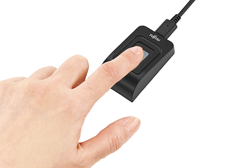
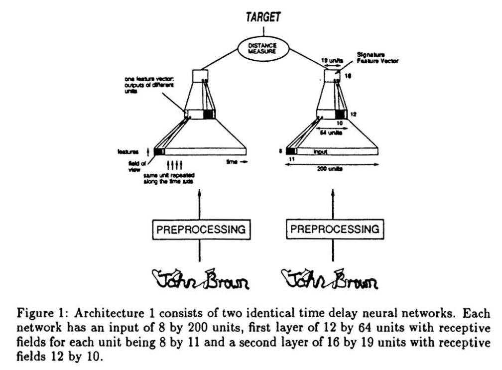
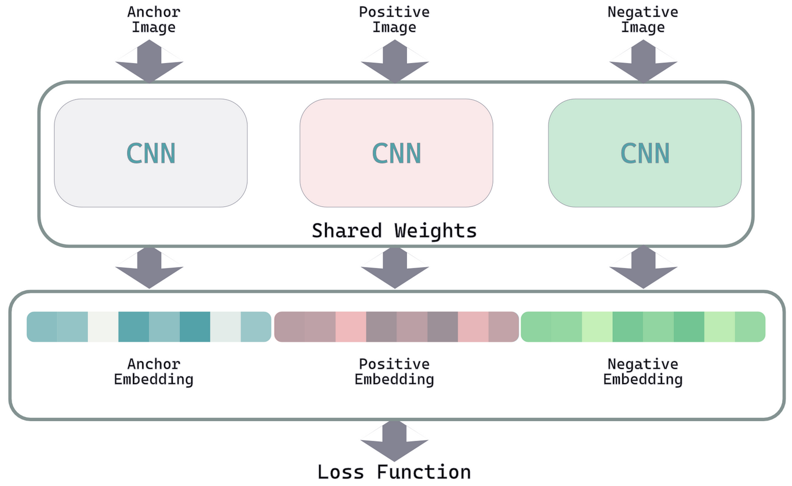

# Siamese Networkを用いた顔認識モデルの構築

## はじめに
顔認識システムを構築する際に、**「1対1」モードと「1対多」モード**という2つの主要な手法があります。本記事では、特に「1対1」モードに焦点を当て、**Siamese Network（サイアムネットワーク）を用いた顔認識モデルの設計と構築**について詳しく解説します。


## 顔認証タスクのスコープ
一口に顔認証システムといっても、どのようなシーンで使われるのかの想定によって、システム構成が異なってきます。具体的には、使用される学習済みモデルが異なってくる、ということです。

### 小規模タスク
特定環境、例えば企業内の認証システムなどでは、高精度な1対1認証が求められます。最もよく使用されるのは指紋認証です。スマホのロック解除が良い例ですね。企業内の顔認証システム構築では一般的にこのスコープに含まれます。

このようなスコープで使われるのは1対1認証です。 小規模タスクで用いられます。



### 中規模タスク
公共の顔認識がこのスコープに含まれます。防犯カメラの映像解析やネットを対象にしたリサーチなどですね。

オープンソースで開発されている[FACE01](https//github.com/yKesamaru/FACE01_DEV)や[その学習済みモデル](https//github.com/yKesamaru/FACE01_trained_models)はここに含まれます。


### 大規模タスク
全人種を対象にした顔認証システムがここに含まれます。

## 【1対1モード】と【1対多モード】の違い

顔認識システムには、大きく分けて2つのモードがあります。それぞれの特徴と使用シーンを見てみましょう。

### 【1対1モード】
「1対1」モードは、2つの顔画像を比較し、それらが同一人物かどうかを判定する手法です。このモードは、例えば生体認証やセキュリティ認証など、ペア単位の顔認識が求められるタスクに適しています。

- 類似度計算が中心。
- ペア単位での高精度な判定が可能。
- データベースとの照合を行わないため、処理が簡潔。

通常、顔認証システムと呼ばれる多くが「1対1」モードであるといえます。正解データとの突き合わせをすればよいだけなので、比較的簡単に精度を稼げます。

### 【1対多モード】
一方、「1対多」モードは、1つの顔画像をデータベースと照合し、最も一致する人物を特定する方法です。このモードは、監視カメラシステムや公共施設のアクセス制御など、大量の顔データを管理するシステムで一般的に使用されます。

- データベース全体と照合するため、計算コストが高い。
- 顔IDの分類タスクとして設計される。
- 複数の人物から候補を絞り込むことが可能。

先ほど紹介した[FACE01](https//github.com/yKesamaru/FACE01_DEV)や[その学習済みモデル](https//github.com/yKesamaru/FACE01_trained_models)はここに含まれます。

「1対多」モードは「1対1」モードを包含します。

$$1\text{-}1\ \text{モード} \subseteq 1\text{-}\text{多}\ \text{モード}$$

一般的に1対多モードを作成するには1対1モードよりコストがかかる傾向があります。


| 特徴              | 1対1モード                                   | 1対多モード                                   |
|-------------------|--------------------------------------------|--------------------------------------------|
| **概要**           | 特定の個人の顔データと入力画像を比較する。       | 入力画像をデータベース内の複数の顔データと照合する。 |
| **特徴**       | 比較対象が1人のみで誤認識が少ない。 | 誤認識を防ぐ高い精度が必要。 |
| **用途**          | IDカードやICカードによる本人認証。             | 監視カメラや公共施設での人物特定。             |


## Siamese Networkとは？

### 概要
[Siamese Networkは1994年にBromleyらによって提案](https//papers.nips.cc/paper/1993/file/288cc0ff022877bd3df94bc9360b9c5d-Paper.pdf?utm_source=chatgpt.com)され、当初は[手書き文字認証に使用](https//jglobal.jst.go.jp/detail?JGLOBAL_ID=201902267980547740&utm_source=chatgpt.com)されていました。



このネットワークは、2つの入力を受け取り、それらの類似度を学習する構造を持っています。現在では以下のような分野で広く活用されています。
- 顔認証
- 画像類似度検索
- 生体認証
- 画像位置合わせ

### 主な特徴
Siamese Networkは、同一構造の2つのサブネットワークで特徴を抽出し、その類似性を計算します。この構造により、「1対1」タスクに特化した高い性能を発揮します。



## Siamese Networkが【1対1】学習に適しているワケ

Siamese Networkが「1対1」モードに適している主な理由は以下の通りです。

1. **類似度を直接学習する特性**
   - 特徴ベクトル間の距離（コサイン類似度など）とトリプレットロスなどを使用し、同一人物の距離を最小化、異なる人物の距離を最大化する

2. **少ないデータや限定的なタスクへの適応力**
   - データ量が限定されている場合でも、ペア単位での学習が可能なため、少ないデータセットでも高い精度を稼げる

3. **汎用性の高さ**
   - 顔認証以外の生体認証や類似度判定タスクにも応用可能

## Siamese Networkにおけるバックボーン

Siamese Networkの性能は、バックボーンの選択によって大きく左右されます。

### 概要
EfficientNetV2やResNetなど、高性能なバックボーンを利用することで、入力画像から有用な特徴を効率的に抽出できます。

### バックボーンの役割
バックボーンは、ネットワークの基盤として機能し、入力データを低次元の特徴ベクトルに変換します。この特徴ベクトルが、類似度計算や分類タスクの基盤となります。

### ネットワーク全体の役割
Siamese Networkでは、バックボーンで抽出された特徴ベクトルを比較し、入力ペアの類似性を判定します。これにより、同一人物か否かの判断が可能になります。


## Siamese Networkに最適な損失関数

Siamese Networkでは、以下のような損失関数を使用して類似度を学習します。

### Contrastive Loss
Contrastive Lossは、2つの入力間の距離を学習するために使用されます。同一人物の場合は距離を最小化し、異なる人物の場合は距離を最大化します。

### Triplet Loss
Triplet Lossは、アンカー、ポジティブ、ネガティブの3つの入力を用いて類似性を最適化します。この損失関数は、埋め込み空間での識別性を向上させる効果があります。dlibの学習済みモデルはこのトリプレットロスを採用しています。

### Binary Cross-Entropy Loss
Binary Cross-Entropy Lossは、2つの入力が同一か否かを確率的に予測する損失関数です。主に類似度を確率として出力したい場合に使用されます。

## Siamese Networkで必要なID数の見積もり

### ID数よりペア数が重要
Siamese Networkでは、IDの数そのものよりも生成可能なペアの数が重要です。
- **同一ID内（Positiveペア）** 同一人物間でのペア。
- **異なるID間（Negativeペア）** 異なる人物間でのペア。

### 推奨されるID数の目安
- **小規模タスク** 数百ID。
- **中規模タスク** 1000～2000ID。
- **大規模タスク** 5000ID以上。

### その他の重要点
ペアの多様性や各IDに含まれる画像数がモデルの性能に影響を与えるため、顔画像データセットの質が重要です。

## オプティマイザとスケジューラの選択

### Adam + CosineAnnealingLR
- **適用シーン**
   - 初期実装や汎用的な学習タスク。
- **特徴**
  - Adamの安定した収束性能と、CosineAnnealingLRの柔軟な学習率調整を組み合わせた構成。
  - 学習の中盤で学習率を徐々に下げ、収束をスムーズにする。
- **メリット**
  - 調整が少なくて済み、広範なタスクで安定した性能を発揮。

### AdamW + ReduceLROnPlateau
- **適用シーン**
   - 大規模モデルや過学習が懸念される場合。
- **特徴**
  - AdamWがL2正則化で過学習を抑制し、ReduceLROnPlateauが学習の停滞時に動的に学習率を調整。
- **メリット**
  - モデルの安定性と精度向上を両立できる。
  - 検証損失が改善しないタイミングで自動的に学習率を調整。

### SGD + StepLR
- **適用シーン**
   - 大規模データセットや微調整が必要な場合。
- **特徴**
  - SGDによるシンプルで計算効率の良い更新と、StepLRによる段階的な学習率減少を組み合わせ。
- **メリット**
  - 長期間の学習や大規模データでのモデル改善に効果的。

### Ranger + ExponentialLR
- **適用シーン**
   - 勾配の変動が激しい場合や学習が不安定な場合。
- **特徴**
  - RAdamとLookaheadを組み合わせたRangerが滑らかな収束を提供し、ExponentialLRが学習率を指数関数的に減少させる。
- **メリット**
  - 特に学習初期の不安定性を抑えつつ、後半での収束をスムーズにする。

### [schedule_free](https://github.com/facebookresearch/schedule_free)
「[全ての学習率スケジューリングを過去にするOptimizer](https://zenn.dev/dena/articles/6f04641801b387)」で紹介されている彗星の如く登場した期待のオプティマイザ。

> - warmup、learning rate scheduler、訓練終端時刻の指定、全て不要です。
> - 安定かつ高速に収束します。多くの場合でAdamやAdamWより強いです。

詳しくは記事を参照してください。

> 特にこれで論文を書いたりするわけでもないので、新規に網羅的な性能実験などはおこなっていません。つまり、皆さんにとっては依然として「どこの馬の骨ともわからないoptimizer」の類ではあるわけですが、それをあなたにとっての新しい「これ使っときゃOK」にするかどうかは、あなたの好奇心次第です。

初期試行には鉄板の「Adam + CosineAnnealingLR」、大規模学習には「SGD + StepLR」、学習が不安定な場合には「Ranger + ExponentialLR」といった形が代表的です。個人的には[schedule_free](https://github.com/facebookresearch/schedule_free)に期待を寄せています。

## Siamese Networkやトリプレットロスを用いて学習する際の便利なライブラリ

### [PyTorch Metric Learning](https://kevinmusgrave.github.io/pytorch-metric-learning/)
PyTorch Metric Learningは、Siamese Networkやトリプレットロスを用いた学習を簡単にするためのライブラリです。

**特徴**
- Contrastive LossやTriplet Lossをサポート。
- ハードネガティブマイニング機能が付属。

**利点**
- モジュールが豊富でカスタマイズが容易。
- ドキュメントが充実しており初心者にも扱いやすい。

## Siamese Networkの実装例

以下はSiamese NetworkをEfficientNetV2をバックボーンとして構築し、Triplet Lossを使用した学習コードの例です。

```python
import torch
import torch.nn as nn
import torch.optim as optim
from timm import create_model
from pytorch_metric_learning import losses, distances, samplers
from torchvision import datasets, transforms
from torch.utils.data import Subset, DataLoader
from sklearn.model_selection import StratifiedShuffleSplit
import numpy as np

# Siamese Networkの定義
class SiameseNetwork(nn.Module):
    def __init__(self, embedding_dim=512):
        super(SiameseNetwork, self).__init__()
        # EfficientNetV2をバックボーンとして使用（timmからインポート）
        self.backbone = create_model('tf_efficientnetv2_b0.in1k', pretrained=True, num_classes=0)
        num_features = self.backbone.num_features  # バックボーンの特徴次元数を取得
        # 埋め込みサイズを指定して全結合層を追加
        self.embedder = nn.Linear(num_features, embedding_dim)

    def forward(self, x):
        return self.embedder(self.backbone(x))

# ハイパーパラメータの設定
embedding_size = 512
batch_size = 32
sampler_m = 4  # クラスごとにサンプリングする画像数
data_dir = "path/to/data"  # データセットのディレクトリ

# データ変換の設定
train_transform = transforms.Compose([
    transforms.Resize((224, 224)),
    transforms.ToTensor(),
    transforms.Normalize(mean=[0.485, 0.456, 0.406], std=[0.229, 0.224, 0.225]),
])

test_transform = transforms.Compose([
    transforms.Resize((224, 224)),
    transforms.ToTensor(),
    transforms.Normalize(mean=[0.485, 0.456, 0.406], std=[0.229, 0.224, 0.225]),
])

# データセットの準備
class CustomImageFolder(datasets.ImageFolder):
    def __init__(self, root, transform=None, target_transform=None):
        super().__init__(root, transform=transform, target_transform=target_transform)

train_dataset = CustomImageFolder(root=data_dir, transform=train_transform)
full_dataset = CustomImageFolder(root=data_dir, transform=test_transform)

# StratifiedShuffleSplitを使用してデータを分割
sss = StratifiedShuffleSplit(n_splits=1, test_size=0.2, random_state=0)
train_idxs, val_test_idxs = next(sss.split(np.array(train_dataset.samples), np.array(train_dataset.targets)))

# 訓練セットのSubsetを作成
train_subset = Subset(train_dataset, train_idxs)
train_targets = [train_dataset.targets[i] for i in train_idxs]

# val_test_idxsに対応するターゲットを抽出するためのインデックスを取得
val_test_targets = [full_dataset.targets[i] for i in val_test_idxs]
sss = StratifiedShuffleSplit(n_splits=1, test_size=0.5, random_state=0)
val_idxs, test_idxs = next(sss.split(val_test_idxs, val_test_targets))

val_subset = Subset(full_dataset, [val_test_idxs[i] for i in val_idxs])
test_subset = Subset(full_dataset, [val_test_idxs[i] for i in test_idxs])

# サンプラーの設定
sampler = samplers.MPerClassSampler(train_targets, m=sampler_m)

# データローダーの準備
train_dataloader = DataLoader(train_subset, batch_size=batch_size, sampler=sampler)
val_dataloader = DataLoader(val_subset, batch_size=batch_size, shuffle=False)
test_dataloader = DataLoader(test_subset, batch_size=batch_size, shuffle=False)

# モデルの初期化
model = SiameseNetwork(embedding_dim=embedding_size)
device = torch.device("cuda" if torch.cuda.is_available() else "cpu")
model.to(device)

# オプティマイザの設定
lr = 1e-4
weight_decay = 1e-5
eps = 1e-8
optimizer = torch.optim.AdamW(
    model.parameters(),
    lr=lr,
    weight_decay=weight_decay,
    eps=eps
)

# スケジューラの設定
T_max = 50
eta_min = 1e-6
scheduler = torch.optim.lr_scheduler.CosineAnnealingLR(
    optimizer,
    T_max=T_max,
    eta_min=eta_min
)

# 損失関数の設定
loss_fn = losses.ContrastiveLoss(
    pos_margin=0.05,
    neg_margin=1.0,
    distance=distances.CosineSimilarity()
)

# 学習ステップの例
for epoch in range(1):
    model.train()
    for batch in train_dataloader:
        optimizer.zero_grad()
        inputs, labels = batch
        inputs = inputs.to(device)
        embeddings = model(inputs)
        loss = loss_fn(embeddings, labels)
        loss.backward()
        optimizer.step()
    scheduler.step()
    print(f"Epoch {epoch + 1}, Loss: {loss.item()}")

```
